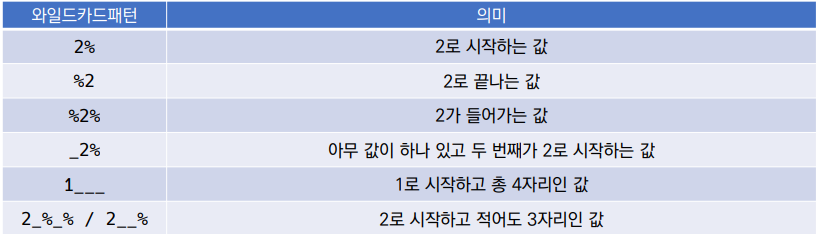

# WHERE claus
- 비교연산자
    - =, >, >=, <=, <
- 논리 연산자
    - AND
    - OR
    - NOT
    - BETWEEN 값1 AND 값2
        - 값1과 값2 사이의 비교
    - IN
        - 목록 중에 값이 하나라도 일치하면 성공
    - LIKE
        - 비교 문자열과 형태 일치
        - 와일드카도( % : 0개 이상 문자, _ : 1개 단일 문자 )
    - IS NULL / IS NOT NULL
        - NULL 여부 확인
        - NULL이 아니라 공백인 경우 존재! 주의!
    - 부정 연산자
        - !=, ^=, <>
        - NOT ~
# SQLite Aggregate Functions 집계 함수
- 값에 대한 게산 수행, 단일 값 반환
    - 여러 행으로부터 하나의 결괏값을 반환하는 함수
- SELECT 구문에서만 사용됨
    - COUNT(), AVG(),MIN,MAX,SUM
# LIKE
- 패턴 일치 기반 데이터 조회
- SQLite는 패턴 구성을 위한 2개의 wildcards를 제공
    - %(0개 이상의 문자)
        - 이 자리에 문자열이 있을 수도, 없을 수도 있다.
    - _(임의의 단일 문자)
        - 이 자리에 반드시 한개의 문자가 존재
## LIKE statement
    - SELECT * FROM 테이블이름  WHERE 컬럼 LIKE 패턴
    
# ORDER BY
- 조회 결과 집합 정렬
- SELECT 문에 추가하여 사용
- 정렬 순서를 위한 ASC(오름차순), DESC(내림차순)
```SQL
SELECT COUNT(*) 
FROM 테이블이름 
WHERE expression
ORDER BY 칼럼이름or조건 ASC/DESC
HAVING 데이터조건
LIMIT N OFFSET N
;
```